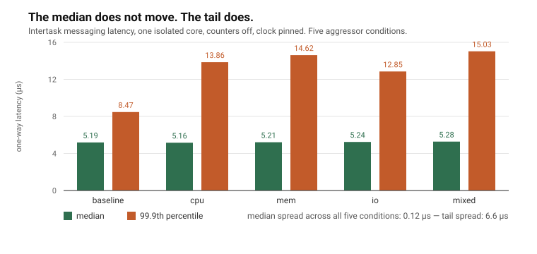
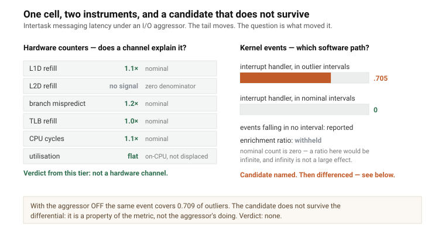

# Design principles, and a worked example

*Background note for the MCIB project. Licensed CC BY 4.0.*

## The mental model, before anything else

```
        profile  ──────►  attribute  ──────►  countermeasure
     what the tail is    what made it       what to do about it

                                            tune       configuration
                                            partition  a mechanism bounds it
                                            ceiling    design around it
```

**A measurement that does not run to a countermeasure is not finished.**

A latency figure is an *input* to the first stage, not an output of the method.
An attribution that names a channel but not what to do about it stops one step
short of useful. A countermeasure proposed without attribution is guesswork
wearing a number.

That is the whole claim. Everything else on this page exists to keep the loop
honest — because the loop is easy to run and easy to run wrongly, and a
confident wrong verdict is worse than no verdict at all.

The three outcomes are **three different actions**, which is why choosing
between them is the point rather than a label at the end:

| | what it means | what you do on Monday |
|---|---|---|
| `tune` | a configuration change removes it | change affinity, isolation, a governor, a priority |
| `partition` | a mechanism bounds it | reserve cache ways, colour, route interrupts, budget bandwidth |
| `ceiling` | nothing available moves it | change the design, or accept the bound and argue it |

---

## How this page is organised

Most benchmarks are judged on what they measure. This one should also be judged
on **what it refuses to say** when the evidence does not support it. The
principles below exist because each prevents a specific wrong answer — and
every one was learned by producing that wrong answer first, on real hardware,
in this project.

If you are evaluating whether to build on MCIB, this is the page that tells you
how it will behave when the data is ambiguous. That is the case that matters.

---

## 1. The loop must complete — and `no verdict` is how it completes honestly

Every result ends in `tune`, `partition`, `ceiling` — or **no verdict, with the
reason**. The first three are the loop finishing. The fourth is the loop
refusing to finish on evidence that would not support it, which is the same
commitment seen from the other side.

The instrument this project grew out of had a rule that always produced
something. That is how it issued a cache-eviction verdict, with a recommended
countermeasure, on a run **with no aggressor running at all**. The ratio behind
it was computed from a denominator of zero, and infinity cleared the threshold.

A tool that always answers is not more useful than one that sometimes declines.
It is less trustworthy, and in exactly the cases where trust matters.

---

## 2. Refuse rather than estimate

Two contexts in different domains can read the same counter at the same
frequency and still not share a time origin — under a hypervisor, each guest
sees the counter through its own offset, and that offset is not readable from
inside the guest.

So MCIB establishes the relationship by measurement, or it **declines to emit a
cross-domain interval at all** and reports the consumer-side one instead.

The alternative — producing a number that looks fine and is wrong by an unknown
constant — is worse than producing nothing, because nothing downstream can
detect it.

---

## 3. Events are primary; the interval rule is named and versioned

A victim records timestamped events and computes no latency. Intervals are
derived afterwards by a rule that is named, versioned and recorded with the
result.

This is not ceremony. Two defensible reconstruction rules applied to **one
capture of 800,000 context switches** differed by a **factor of three**, and
nothing in either output showed which had been used. One matched a thread's
yield to the very next event; the other scanned forward past same-thread
events, which on a two-thread alternation matches across a whole cycle.

Because the events survive, the rule can be corrected and re-applied to data
already taken. Because the rule is recorded, two datasets can be compared —
and comparing datasets starts by comparing rules.

---

## 4. The instrument measures itself

At startup the probe times each available clock source, picks one, and
calibrates its own per-event cost. Both figures go into every record.

This matters more than it sounds. On one metric, enabling eight hardware
counters **more than doubled the latency being measured** — the counters-on
distribution is not the counters-off distribution, and a verdict derived across
the two would be meaningless. On another, the instrument cost nearly three
times the signal.

MCIB reports the instrument-to-signal ratio with every verdict and flags the
ones where the instrument dominates. An attribution drawn from data that is
three-quarters instrument is not defensible because the arithmetic is sound.

---

## 5. Record the conditions, or the number is not comparable with itself

Every record carries the CPU governor and the clock the run actually ran at,
the temperature, the isolation settings that were **active** rather than
requested, and what else was running.

An unpinned CPU governor moved a median by 30% in this project's own data — in
the direction that made a loaded system look **faster** than an idle one, which
inverted a published conclusion. Nothing about the numbers revealed it. The
per-run clock frequency did, and only because it was recorded.

A corollary: a command-line parameter is a *request*, not an *effect*. On the
reference board two isolation parameters appear in the boot command line, are
rejected by the kernel, and have never been active.

---

## 6. Declare what a backend can promise; mark what it cannot

A counter backend declares whether counting follows the context and whether it
can detect preemption. A segment the backend cannot vouch for is **marked**,
not quietly included.

A per-CPU backend is available and is deliberately not the default: it is much
cheaper, and it counts everything the core ran — including a peer thread.
Cheaper is not better when the extra counts belong to someone else.

---

## 7. Compose; never replace

`ros2_tracing`, CARET, LTTng and perf are not competitors. Where a stack
instruments itself, MCIB consumes its events rather than instrumenting it
again. Where the user owns the victim, four probe calls are enough. Where
neither holds, MCIB measures at a boundary it controls or treats the component
as a black box — and says which.

**MCIB never patches a third party's source to measure it**, and never claims
to see inside a closed accelerator. The span is opaque; attribution there is
differential only.

---

# A worked example

The loop, run once on real records: intertask messaging latency on an isolated
core, under an I/O aggressor, against the same metric with the aggressor off.
**Profile, attribute, countermeasure** — the three steps below are those three
stages, and the fourth is what the method declined to say.

## Step 1 — profile



The typical case is untouched: the median moves 0.12 µs across five aggressor
conditions. The tail moves 6.6 µs. Whatever is happening is rare and large,
which is the only part a deadline argument cares about.

**This is also the first thing that is easy to get wrong.** Before the clock
was pinned, the same experiment said the aggressors made the task *faster* —
because a loaded board clocked up. That was a verdict of its own: `tune`, pin
the governor, re-measure. Only then does the real interference appear.

## Step 2 — attribute



Two tiers answer different questions.

**Counters** ask whether a hardware channel explains it. Here every channel is
nominal, and one returns `no signal` rather than a ratio, because its nominal
median is zero. Utilisation is flat, so the thread was on-CPU and executing —
not displaced by something else.

**Kernel events** ask which software path. An interrupt handler is present in
70.5% of outlier intervals and in none of the nominal ones. That is a strong
candidate, and the enrichment *ratio* is still withheld: dividing by zero
nominal occurrences would give infinity, which is not a large effect but an
absent denominator.

## Step 3 — the verdict artefact

Tier 2 named a candidate. The method then asks the question that decides
whether it is the *aggressor's* doing: **does it separate any more strongly
with the aggressor running than without it?**

It does not. The same event covers 72% of outlier intervals under the
aggressor and 71% with the aggressor off. On a second metric it covers
*less* under load than without it.

So the event is a property of the metric — real, and worth reporting — and it
is not what the aggressor did. The artefact says exactly that:

```json
{
  "verdict":  { "class": "no verdict",
                "reason": "candidate event does not survive the differential",
                "statistic": "coverage of the outlier population",
                "flags": [] },
  "evidence": {
    "counters":     { "l2d_refill": "no signal (nominal median 0)",
                      "others": "1.0-1.2x, nominal",
                      "displacement": "flat - on-CPU, not displaced" },
    "trace":        { "irq_handler_entry": {
                        "coverage_aggressor_on":  0.7210,
                        "coverage_aggressor_off": 0.7094,
                        "nominal_occurrences": 0,
                        "ratio": "withheld - zero denominator",
                        "differenced": "not material - within the cell's own
                                        repeat spread" } },
    "differential": { "p999_shift_ns": 4380, "p999_resolvable": true,
                      "repeat_spread_ns": 620 },
    "instrument":   { "null_interval_p50_ns": 331,
                      "instrument_to_signal": 0.06 }
  },
  "inputs":   [ "imlat-io-r1.json  sha256:19dd4202…",
                "imlat-baseline-r1.json  sha256:3237f8d0…" ],
  "analysis": { "tool_version": "…", "thresholds": { "…": "…" } }
}
```

*This shows the artefact shape the specification defines, populated from a
real evidence run.*

Read what is in it: the statistic the finding rests on, the repeat spread
beside every shift — because a difference smaller than a cell's own noise is
not a difference — the instrument's own cost, every threshold used, and every
input by content hash.

**A verdict you cannot audit is an opinion with a schema.**

## Step 4 — what it does not say, and why that took three attempts

The tail moves under load. An interrupt handler dominates the outlier
population. Both are true, and the method still declines to say the aggressor
caused the outliers through that handler — because the evidence does not
separate the two.

That answer was not reached first time. Written against an earlier version of
the rules, this same data produced eleven `tune` verdicts recommending
interrupt affinity. They were withdrawn when the aggressor-off side was
examined and found to separate just as strongly. The rule that now prevents it
— **a candidate must survive the differential** — already existed for hardware
counters and had not been carried across to kernel events.

Three times in this project a guard has stopped an answer the arithmetic would
have licensed. That is not a story about tooling maturity. It is what the
method is **for**: the arithmetic is never the hard part, and a benchmark that
cannot decline is not measuring, it is asserting.

---

## How this helps you

**If you are choosing silicon**, the verdict distinguishes a board you can tune
from a board that will never hold your deadline — before you commit a design to
it.

**If you are integrating a stack**, it tells you whether the miss you are
chasing is yours to fix in configuration, the platform's to fix in
partitioning, or nobody's.

**If you are building a safety argument**, it produces characterisation data
with its provenance attached — not qualified evidence, but an input a qualified
party can use, with every condition recorded.

**If you are porting to new silicon**, the specification is what makes your
dataset comparable to everyone else's, and the framework is small enough that a
port is a counter map and a backend.

The gap this fills is narrow and deep: not *what* the latency was, not *where*
in the graph it went, but **why the hardware made it slow, and which
countermeasure applies**.

---

*Copyright 2026 Linaro Ltd. SPDX-License-Identifier: CC-BY-4.0*
